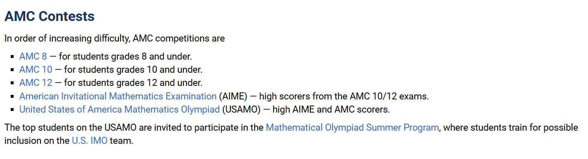

# AMC-Problem-Scraper

*A Python script for scraping AMC problems, answers, and solutions from [Art of Problem Solving](https://artofproblemsolving.com/).*

## Overview

As a mathematics olympiad enthusiast and problem-solving addict, I sometimes need a large collection of problems to practice and keep myself challenged. In this repository, I demonstrate how to scrape mathematics problems from the well-known website *Art of Problem Solving* (AoPS). The competitions targeted by this project are those organized by the American Mathematics Competitions (AMC), as I want to build a broader collection of high-level mathematics problems.

You can read more about the history of [American Mathematics Competitions (AMC)](https://artofproblemsolving.com/wiki/index.php?title=American_Mathematics_Competitions) before choosing which problem set you want to download. From my personal experience, starting with easier problems can help build confidence before moving on to harder ones.



NB: This project is free to use for educational purposes. Commercializing any content from this repo may violate the AoPS community guidelines.

## Project Structure

```
AMC-Problems-Scraper
├── .gitignore
├── README.md
├── sample_problem_AIME.pdf
├── sample_problem_with_solution_AIME.pdf
├── data
│   └── AIME
│       ├── contest_metadata.json
│       ├── full.json
│       ├── full_tex.json
│       └── index.json
├── figures
│   └── AIME
│       ├── Problem
│       └── Solution
├── notebooks
│   └── notebook.ipynb
├── output
│   └── AIME
│       ├── answers_full.json
│       ├── problems_full.json
│       └── solutions_full.json
├── src
│   └── amc_scraper
│       ├── __init__.py
│       ├── amc_scraper.py
│       ├── answers_scraper.py
│       ├── builder.py
│       ├── cli.py
│       ├── config.py
│       ├── downloader.py
│       ├── parser.py
│       ├── problems_scraper.py
│       ├── scraper.py
│       ├── solutions_scraper.py
│       └── utils.py
└── Tex
    └── AIME
        ├── Problem
        └── Problem and Solution
```

## Main Files

| File/Folder | Path | Note |
| :--- | :--- | :--- |
| `answers_full.json`, `problems_full.json`, `solutions_full.json` | `output/AIME` | Raw data scraped directly from the contest source. Tips : You can open/load json files using Excel or your favorite programming language |
| `contest_metadata.json` | `data/AIME` | Metadata for each contest instance, including the source URL and problem count. |
| `full.json` | `data/AIME` | The compiled version, with problems, answers, and solutions merged together. |
| `index.json` | `data/AIME` | Lightweight problem metadata, saved for a future project. |
| `full_tex.json` | `data/AIME` | The result of parsing `full.json` into LaTeX-ready problem statements. |
| `Problem` | `Tex/AIME` | LaTeX documents containing problems only, generated by the script and split by year. |
| `Problem and Solution` | `Tex/AIME` | LaTeX documents containing problems, answer keys, and solutions, split by year. |
| `sample_problem_AIME.pdf`, `sample_problem_with_solution_AIME.pdf` | root | Sample LaTeX output compiled from `full_tex.json`. |

## Script Documentation

| File | Description |
| :--- | :--- |
| `config.py` | Shared configuration: Selenium Chrome options, wait-time constants, CSS selectors, regex patterns, and input/output paths and filenames. |
| `utils.py` | Shared helpers: `print_message` for cleaner console output, `wait_for_visible_count` as a custom Selenium wait condition, `check_retrieved_file` for loading previously scraped files, and `generate_all_and_pairs` for finding sources that still need to be scraped. |
| `scraper.py` | The core fetching layer. `get_first_soup` gets the AIME contest index page, `get_soup` fetches and parses individual problem, answer-key, and solution pages with built-in retries, and `get_contest_metadata` builds `contest_metadata.json` from the index. |
| `problems_scraper.py` | `get_problems_from_source` extracts individual problem statements from a contest's Problems page; `get_problems_full` runs this across all pending sources with progress tracking, error recovery, and optional export to `problems_full.json`. |
| `answers_scraper.py` | `get_answers_from_url` extracts individual answers from a contest's Answer Key page; `get_answers_full` runs the process across pending sources and exports the results to `answers_full.json`. |
| `solutions_scraper.py` | `get_solutions_from_page` parses a problem's Solution page; `get_solutions_from_source` collects all 15 solutions for a contest; `get_solutions_full` runs the process across pending sources and exports the results to `solutions_full.json`. |
| `builder.py` | Combines scraped data into finished datasets. `build_full` merges problems, answers, and solutions into `full.json`, `build_index` creates a lightweight `index.json`, `check_missing` flags rows with missing fields, and `build_tex` writes a contest-year-version to a `.tex` file. |
| `downloader.py` | Handles figures. `get_download_list_problem` and `get_download_list_solution` scan `full.json` for embedded images and Asymptote figures and build download lists; `download_figures` fetches them over HTTP or uses a Selenium screenshot for GIFs; `get_figures_problem` and `get_figures_solution` are the entry points. |
| `parser.py` | Converts scraped HTML into LaTeX. `decode_prob` walks the HTML tree from the bottom up and replaces tags according to `ACT_PROB`; `decode_link`, `decode_img`, `decode_dldd`, `decode_list`, and `cleaning_tex` handle links, figures, definition lists, ordered/unordered lists, and general LaTeX cleanup; `parsing_prob_to_tex` runs the pipeline for a contest and writes `full_tex.json`; `xml_method` converts embedded MathML to LaTeX through an XSLT transform. |
| `amc_scraper.py` | Top-level pipeline orchestrator. `generate_tex_json` runs the full build chain for a contest (`build_full` → `build_index` → `add_figure_list` → `parsing_prob_to_tex` → `parsing_sol_to_tex`); `generate_tex_folder` then writes one `.tex` file per contest-year-version into `Tex/AIME/Problem` or `Tex/AIME/Problem and Solution`, depending on `type`, and creates a `copas.txt` containing `\input{}` lines for all of them. |
| `__init__.py` | Empty; used only as a package marker. |
| `cli.py` | Empty for now; planned but not yet developed. |

## Future Development

As I mentioned in my previous projects, this is also still a toddler project. I built it because I made a web application, [Math-Gacha](https://alzimna.github.io/Math-Gacha/index.html), and wanted to enrich the collection of problems used by the app. Another reason is that, as a seasonal mathematics olympiad trainer, I create my own teaching materials, and this repo helps me grow both my collection of explained problems and my exercise problems.

Since I have a full-time job and only code in my spare time, so far I have only been able to scrape AIME problems before moving on to another planned project. So there is still a lot of development left to do.

- Scrape other AMC competitions.
- The TeX files for problems and solutions can already be compiled, but there are still many warnings caused by the variety of solution formats. Some minor errors still need to be fixed when compiling with a TeX compiler. Overall, however, the output is already readable, as you can see in the sample files.
- I built much of the script with help from free-tier Claude and GPT. Sometimes they ruined my code, so I decided to rely mainly on my own logic. As a non-computer-science undergraduate, the efficiency of my code can probably still be improved.


## Update (21/09/2026) - Final Version V2.0

- Previously, to reduce execution time, only the `solution_scraper` used a `ThreadPoolExecutor`. In the updated version, it is now used for the metadata, problems, and answers scrapers, reducing the aggregate execution time by **3×**.

- Fixed the `decode_list` parser for `.tex` files. It currently supports a single `<ol>`/`<ul>` tag but does not yet support nested lists.

- Retrieved all AMC contests and updated the existing sample files across all contests.

- Added difficulty data based on [AoPS's difficulty breakdown](https://artofproblemsolving.com/wiki/index.php?title=AoPS_Wiki:Competition_ratings).

- Compiled a total of **6,957 problems with solutions** from forum discussions on AoPS across all AMC contests, presented in `AMC_full.xlsx`.

- Built `html.json` for all contests for my [Math Dojo](https://alzimna.github.io/Math-Dojo/) project.

